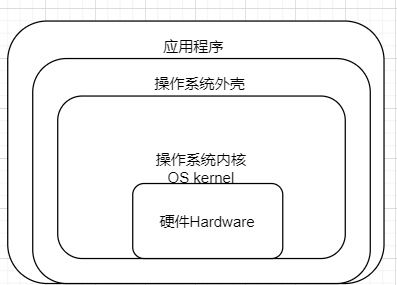

# 模块一：Java语言基础

# 一、初识计算机和Java语言

## 1.计算机的基本概念

计算机是一种设备，主要由计算机硬件和计算机软件两个部分组成。 

硬件：客观存在的计算机相关设备。

软件：用于控制各种硬件设备完成各种功能。

## 2.常见的主要硬件

**CPU（中央处理器）、内存、硬盘**、输入输出设备、主板、机箱、电源等。

## 3.主要硬件的详解

### CPU

- 中央处理器Center Processing Unit
- 是最核心的部件，类似于人的大脑
- 是运算核心和控制核心，所有运算都由其完成
- 解释计算机指令以及处理计算机软件中的数据

### 内存Memory

- 存储部件
- 暂时存放CPU中的运算数据，以及与硬盘等外部存储器交换的数据
- CPU直接访问内存的数据，且效率比较高
- 容量小不能实现永久存储，一旦断电会造成数据的丢失
- 时刻用Ctrl+S保存

### 硬盘

- 永久存放数据内容，容量大且断电不丢失
- CPU不能直接访问硬盘中的数据，若希望访问则需要先加载到内存中
- 硬盘与内存互补

### 输入输出设备

- 标准输入设备：键盘
- 标准输出设备：显示器

## 4.常见的主要软件

- 系统软件
    - 操作系统
        - Windows
        - Unix
        - Linux
        - IOS
        - Android
- 应用软件（装在操作系统上的软件）

## 5.计算机的体系结构



## 6.计算机语言的发展

人与计算机直接之间交流表达的方式。

1. 机器语言：二进制代码形式，最初是穿孔卡片。
2. 汇编语言：助记符代表一条机器指令，如ADD、SUB等
3. 高级语言：Java、C、C++、Python等

## 7.Java语言的发展历史

95年问世，基于C语言，为了跨平台产生。

## 8.Java语言的主要版本

Java SE：标准版，Java基础

Java EE：企业版，JavaSE基础上，用于构建企业级的应用。

Java ME：平台微型版，随着Android平台的迅速普及，Java ME已经走向淘汰。

## 9.开发平台的下载和安装

[www.oracle.com](http://www.orcale.com)

## 10.相关概念

javac.exe 编译器

java.exe 解释器

JDK包含JRE，JRE包含JVM

## 11.编写Java程序的流程

注释：

```java
/*
* 项目名称：
* 项目功能：
* 作者：
* 版本：
* 所有者：
* 备注：
*/
```

## 12.跨平台原理

同一字节码由不同的JVM翻译成不同的机器指令。 

# 二、变量和数据类型

## 1.变量的基本概念

声明变量的本质就是在内存中申请一个存储单元。

## 2.变量的声明方式

数据类型 变量名 = 初始值;

（初始值可以省略）

## 3.使用变量的注意事项

- 使用之前必须声明
- 使用之前需要初始化
- 变量不能重复声明
- 非强制：随使用随声明

## 4.标识符的命名法则

- 由数字、字母、下划线以及$等组成，其中数字不能作为开头。（尽量用字母）
- 不能使用Java的关键字（关键字是Java中代表特殊含义的）
- 区分大小写，长度没有限制但不宜过长
- 尽量做到见名知意，支持中文但不推荐使用

## 5.数据类型

- 基本数据类型

    short

    byte

    int

    long

    double

    float

    boolean

    char

- 引用数据类型

## 6.进制之间的转换

前加0b代表二进制、0开头代表8进制、0x开头代表十六进制

### 正十进制转换为二进制

a.除2取余法，十进制数不断除以2取出余数，直到商为零。余数逆排。

b.拆分法，把十进制数拆分为若干个二进制权重的和，有该权重标1，无标0.

### 正二进制转换为十进制方法

a.加权法，二进制的每个数字乘以当前位的权重再累加

### 负十进制转换为二进制

a.先将十进制的绝对值转换为二进制，然后进行按位取反加1（补码）

### 负二进制转换为十进制

先将二进制减一后按位取反，转换为十进制，加负号

## 7.单个字节表示的整数范围

1（符号位）+7位：-128~127

## 8.整数类型

byte、short、int、long（一般用int）

直接写出的整数数据（常量/字面值/直接量），默认为int类型。

赋值long型需要在数字后面加L。

标识符数字不能开头：分不清是直接量还是标识符。

## 9.浮点类型（描述小数）

float、double（一般用double）

float占4个字节，单精度浮点数，可以表示7位有效数字。

double占8个字节，双精度浮点数，可以表示15位有效数字。

浮点的直接量默认double型，赋值float型后加f。

## 10.布尔类型（真假信息）

boolean：只有true/false

内存空间不规定所占大小，可以认为是1个字节。1bit（一个二进制位）就够。

## 11.字符类型Char

用于描述单个字符（包括单个中文字符）的数据类型。

char 占两个字节且没有符号位，表示的范围是0~65535。

ASCII码：计算机中存储字符类的图案数据，给该数据制定一个编号，将编号存储起来。

’0‘-48，’A‘-65，’a‘-97，空格-32 换行符-10

### Unicode字符集

Java字符类型采用Unicode字符集编码，是世界通用的定长字符集，所有的字符都是16位。（Unicode包含ASCII码）

### 转义字符

\"-双引号、\‘-单引号、\\-斜杠、\t-制表符、\n-换行

## 12.类型转换

### 自动类型转换

从小类型转换到大类型，直接转。

byte→short（char）→int→long→float→double

### 强制类型转换

从大类型转换到小类型，强制转，前加括号需要转换的类型。

目标类型 变量名=（目标类型）源类型变量名

强制转换有风险。

## 13.总结Summary

- 变量
    - 概念
    - 声明方式
    - 标识符命名法则
    - 输入输出
- 数据类型
    - 整型byte、short、int、long
    - 浮点型float、double
    - 布尔型boolean
    - 字符型char
    - 常见的进制及转换
    - 数据类型转换
        - 自动转
        - 强制转
    - ASCII码及转义字符

# 三、运算符

## 1.算术运算符

+-*/ %(取余) 

当两个整数相除时，结果只保留整数部分，丢弃小数部分。（令除数和被除数不都是整数则会得到小数结果，强制转double，或者让其中一个乘以1.0（推荐））

除数不能为0（为0编译ok，运行发生java.lang.ArithmeticException（算术异常））

## 2.字符串连接运算符

+可以实现字符串的连接。（或者字符串与其他数据类型“相连”）

只要＋号两边的操作数中有一个操作数是字符串类型，则＋号就当做字符串连接符，否则就是加法运算符。

## 3.关系/比较运算符

>、> =、<、< =、==、！=

关系运算符的最终结果是boolean型

## 4.自增减运算符

++、- -、

变量++表示先让变量的数值作为整个表达式的最终结果，然后再让变量自身的数值加1。

++变量表示先让变量自身的数值加1，再将变量的数值作为整个表达式的最终结果。

## 5.逻辑运算符

逻辑运算符的操作数均为boolean型

&&逻辑与，且，两个都真才为真（短路与，第一个为假则跳过第二个表达式不执行）

||逻辑或，或，两个都为假才假（短路或，第一个为真则跳过第二个表达式不执行）

！逻辑非，取反，真为假，假为真

## 6.三目（条件）运算符

条件表达式？表达式1：表达式2    条件表达式为真执行表达式1，条件表达式为假执行表达式2。

## 7.赋值运算符

= 右边的数据赋值给左边的变量，覆盖变量原来的数值。

赋值表达式本身也有值，值为所赋之值。

+=、-=、*=、/=、……（复合赋值）

byte型+byte型结果是int型（编译器优化）

```java
byte b1=10;
b1=(byte)(b1+2);
b1+=2;//实际等价于b1=(byte)(b1+2);
```

```java
ia==2;//判断变量ia的数值是否等于2
2==ia;//判断2是否等于ia的数值，结果等价，推荐用此
ia=2;//表示将2赋值给ia
2=ia;//编译报错，Error：意外的类型
```

## 8.移位运算符

<<左移运算符，用于将二进制位向左移动，右边使用0补充。

>>右移运算符，用于将二进制位向右移动，左边使用符号位补充。

>>>逻辑右移（无符号右移），用于将二进制位向右移动，左边使用0补充。

## 9.位运算符

&表示按位与运算符，按照二进制位进行与运算，同1为1，一0为0。

|表示按位或运算符，按照二进制位进行或运算，同0为0，一1为1。

~表示按位取反，按照二进制位进行取反，1变0,0变1。

^表示按位异或，按照二进制位进行异或，同0异1。

## 10.运算符优先级

小括号()极高，赋值运算符=极低，若无法确认优先级，则使用（)来确保。

## 11.总结Summary

- 算术运算符+-*/%
- 字符串连接符 +
- 关系运算符><> =< = == ！=
- 自增减运算符++ —（变量前变量后）
- 逻辑运算符 && || ！（短路特性）
- 条件（三目）运算符？：
- 赋值运算符 = += -=*=/ =
- 移位运算符<< >> >>>
- 位运算符& | ~^
- 优先级（）>>>其他>>> 赋值=

# 四、流程控制

## 1.分支结构

根据条件表达式的结果不同来进行不同选择。

### if分支结构

```java
if(条件表达式){
	语句块;
}
```

条件表达式成立执行语句块，不成立跳过语句块。

### if else分支结构

```java
if(条件表达式）{
	语句块1;
}else{
	语句块2;
}
```

条件表达式成立执行语句块1，不成立执行语句块2。

### if else if else语句

```java
if(条件表达式1）{
	语句块1;
}else if(条件表达式2){
	语句块2;
}else{
	语句块3;
}
```

条件表达式1成立执行语句块1，1不成立2成立，执行语句块2,1、2都不成立，执行语句块3.

### switch case语句

```java
switch(变量/表达式){
	case 字面值1：语句块1;break;
	case 字面值2：语句块2;break;
	……
	default:语句块n;
}
```

case穿透：无break结束则一直执行以后的代码直到遇到break或者整个switch语句块结束。

Switch到目前以支持byte、short、char、int、枚举、String

## 2.循环结构

根据条件判断是否重复执行代码块

### for循环

```java
for(初始化表达式;条件表达式;修改初始值表达式){
	循环体;
}
```

初始化表达式→条件表达式（是否成立）→成立则执行循环体→修改初始值表达式→条件表达式→不成立则执行for循环以后（循环结束）。

for(;;)-没有循环条件叫做无限循环（死循环）。

### continue关键字

用在循环体中，用于结束本次循环而开始下一次循环。

### break关键字

退出当前语句块，在循环体中直接退出循环。

```java
//随机数生成
import java.util.Random;
Random ra=new Random();
ra.nextInt(100);//生成0-99之间的随机整数
```

**break跳出多层循环:标号方式**

```java
outer:for(...){
	for(...){
		break outer;
	}
}
```

### while循环

```java
while(条件表达式){
	循环体;
}
```

当条件表达式成立执行循环体。

### 比较for循环和while循环

while和for完全可以互换，推荐使用for。

while循环更适合明确循环条件但不明确循环次数的场合中。

for循环更适合明确循环次数或范围的场合中。

死循环：while(true) for(;;)

### do while循环

```java
do{
		循环体;
}while(条件表达式);
```

先执行循环体，再判断条件表达式是否成立。（至少执行一次）

## 3.总结Summary

- 分支结构
    - if
    - if else
    - if else if else
    - switch case
- 循环结构
    - for循环
    - while循环
    - do while循环
    - continue、break关键字
    - 多重循环

# 五、数组及其应用

## 1.一维数组

**概念：**在程序中记录多个类型相同的数据内容时，声明一个一维数组即可。本质是在内存空间中申请一段连续的存储单元。

数组是**相同数据类型**的**多个元素**的容器，元素按线性顺序排列。是引用数据类型。

### 声明

```java
数据类型[] 数组名称 = new 数据类型[数组的长度];
```

调用数组的length属性：获取数组的长度。

通过下标的方式访问数组中的每一个元素，范围：0~n-1。

异常：ArrayIndexOutOfBoundsException 数组越界异常

### 初始化

基本类型的数组创建后，其元素的默认初始值为0（byte、short、int、long、char）0.0（float、double）false（boolean）

```java
//动态方式：声明数组规定长度且不给初始值，使用默认初始值
//静态方式：声明数组的同时给定初始值
数据类型[] 数组名称={初始值1,初始值2,初始值3,…};//方式1
数据类型[] 数组名称=new 数据类型[]{初始值1,初始值2,初始值3,…};//方式2
```

### 内存结构

**栈区：**存储局部变量。

**堆区：**JVM在其内存空间中开辟的一个存储空间，用于存储使用new关键字创建的数组和对象。

基本数据变量的内存地址中直接存放变量值，引用数据变量的内存地址中存放指向对应栈区的地址。

### 数组的优缺点

**优点：**速度快（直接通过下标快速定位）

**缺点：**不能修改长度、元素类型必须相同、内存空间连续、增删时可能需要移动大量元素效率低

### 数组拷贝

```java
System.arraycopy(源数组，源数组起始位置，目标数组，目标数组起始位置，拷贝长度);
```

## 2.数组工具类java.util.Arrays

实现对数组中元素的遍历、查找、排序等操作。

```java
static String toString(int[] a)//输出数组中的内容
static void fill(int[] a,int val)//将参数指定元素赋值给数组中的所有元素
static boolean equals(boolean[] a,boolean[] b)//判断两个数组中的元素和次序是否相同
static static void sort(int[] a)//对数组中的元素进行从小到大的排序
static int binarySearch(int[] a,int key)//从数组中查找key所在的位置
```

## 3.二维数组

每个元素都是一个一维数组的数组。靠两个下标来寻找指定位置的元素。

二维数组的.length属性是一维数组的个数。

```java
//声明
数据类型[][] 数组名称 = new 数据类型[行数][列数];
//初始化
数据类型[][] 数组名称 = {{元素1,元素2,元素3,…},…};
```

二维数组内的每个一维数组元素长度不一定要求一样。

## 4.总结Summary

- 一维数组
    - 基本概念
    - 两种声明方式
        - 静态
        - 动态
    - 增删改查操作
    - 优缺点
- 数组工具类Arrays
- 二维数组
    - 基本概念
    - 两种声明方式